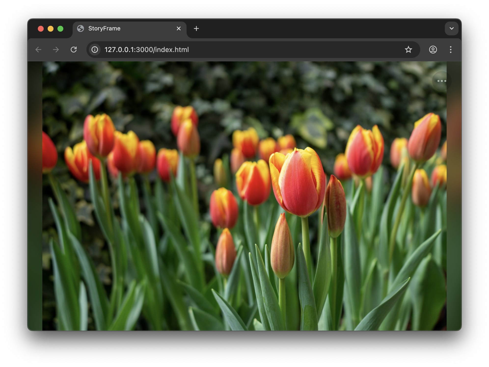
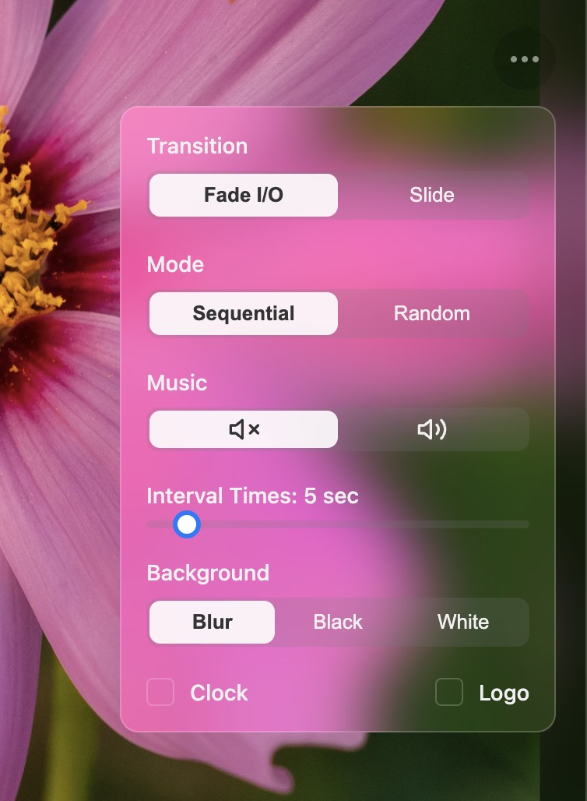

# StoryFrame Slideshow

[繁體中文](README.zh-TW.md)

A modern, feature-rich, and highly customizable full-screen photo slideshow web application.

## Screenshots

### Main Window

### Menu

## Table of Contents
- [StoryFrame Slideshow](#storyframe-slideshow)
  - [Screenshots](#screenshots)
    - [Main Window](#main-window)
    - [Menu](#menu)
  - [Table of Contents](#table-of-contents)
  - [Features](#features)
  - [How to Use](#how-to-use)
  - [License](#license)
  - [Credits](#credits)
    - [Sample Photos License](#sample-photos-license)
    - [Background Music Credit](#background-music-credit)
  
## Features

* **Multiple Transition Effects**: Supports fade, slide, and other effects.
* **Smart Background Mode**: Choose solid black, solid white, or use the current photo as a blurred glass background.
* **Flexible Playback Control**: Supports sequential and random playback, with customizable slideshow intervals.
* **Keyboard Shortcuts**:
    * `←` / `→` / `↑` / `↓`: Manually switch to the previous/next photo (without animation).
    * `Space`: Pause / resume automatic slideshow.
    * `F`: Enter / exit fullscreen mode.
    * `ESC`: Close the settings menu.
* **Optional Add-ons**: Toggleable bottom-right logo and bottom-left real-time clock.
* **Background Music**: Supports background music playback, with on/off control in the menu.
* **Modern UI**: Clean and modern interface with smooth hover and highlight animations.

## How to Use

1.  **Download the Project**: Download all project files to your computer.
2.  **Prepare Photos**:
    * Place all photos you want to display in the `/images` folder.
    * Open the `images.json` file and list all your photo filenames in the array, e.g. `["01.jpg", "photo_trip.png", ...]`.
3.  **Prepare Assets (Optional)**:
    * Name your logo file `logo.png` and place it in the `/assets` folder.
    * Name your background music file `music.mp3` and place it in the `/assets` folder.
4.  **Run Locally**: Due to browser security restrictions, you need to run `index.html` through a local server.
    * **Recommended**: If you use VS Code, install the "Live Server" extension, then right-click `index.html` and select **"Open with Live Server"**.

## License

This project is licensed under the MIT License. See the `LICENSE` file for details.

## Credits

### Sample Photos License

All sample photos in the `/images` folder were taken by **Duncan** and are released under the [**Creative Commons Attribution-ShareAlike 4.0 International (CC BY-SA 4.0)**](https://creativecommons.org/licenses/by-sa/4.0/) license.

You are free to:
* **Share** — copy and redistribute the material in any medium or format  
* **Adapt** — remix, transform, and build upon the material  

Under the following terms:
* **Attribution** — You must give appropriate credit, provide a link to the license, and indicate if changes were made.  
* **ShareAlike** — If you remix, transform, or build upon the material, you must distribute your contributions under the same license (`CC BY-SA 4.0`) or a compatible license.  

### Background Music Credit

The sample music file in the `/assets` folder comes from the following creator and is used under its respective license:

* "[**lofi-song-backyard**](https://pixabay.com/music/id-242713/)" by [**Lofium**](https://pixabay.com/users/lofium-30660321/) from [**Pixabay**](https://pixabay.com/music/) (Pixabay Content License)