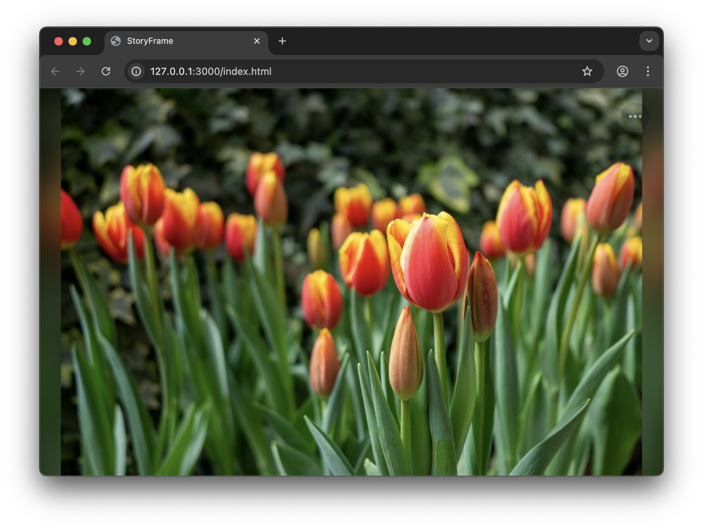
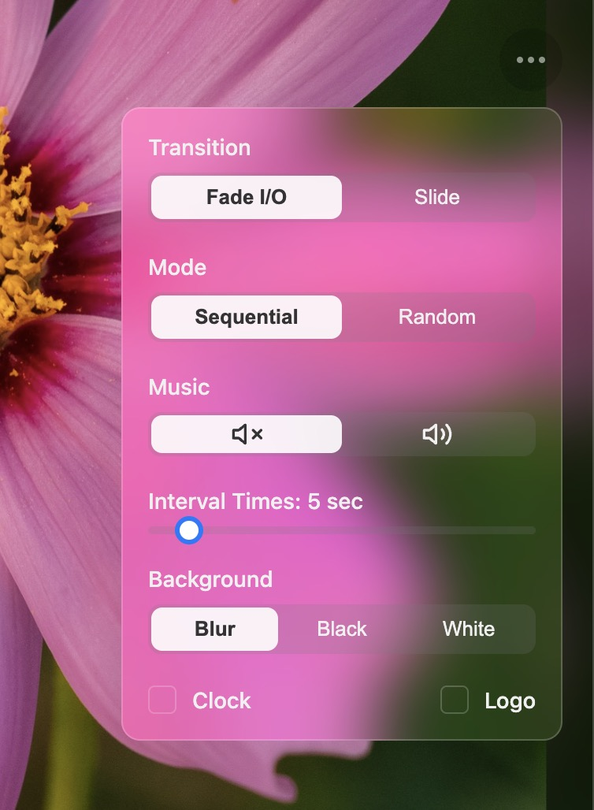

# StoryFrame Slideshow

[English](README.md)

一個現代化、功能豐富且可高度客製化的全螢幕照片輪播網頁。

## Live Demo

**[https://chung0060.github.io/StoryFrame/](https://chung0060.github.io/StoryFrame/)**

## 截圖

### 主畫面

### 選單

## 目錄
- [StoryFrame Slideshow](#storyframe-slideshow)
  - [Live Demo](#live-demo)
  - [截圖](#截圖)
    - [主畫面](#主畫面)
    - [選單](#選單)
  - [目錄](#目錄)
  - [功能特色](#功能特色)
  - [安裝與使用](#安裝與使用)
  - [授權條款](#授權條款)
  - [素材來源](#素材來源)
    - [範例照片授權](#範例照片授權)
    - [背景音樂來源](#背景音樂來源)
  
## 功能特色

* **多種轉場特效**：支援淡入淡出、滑動等效果。
* **智慧背景模式**：可選擇純黑、純白，或使用當前照片作毛玻璃模糊背景。
* **彈性播放控制**：支援循序播放與隨機播放，並可自訂輪播間隔。
* **鍵盤快速鍵**：
    * `←` / `→` / `↑` / `↓`: 手動切換上/下一張照片 (無動畫)。
    * `空白鍵`: 暫停 / 繼續自動輪播。
    * `F`: 進入 / 退出全螢幕。
    * `ESC`: 關閉設定選單。
* **附加元件**：可顯示/隱藏的右下角 Logo 和左下角即時時鐘。
* **背景音樂**：支援背景音樂播放，並可在選單中開關。
* **現代化介面**：採用現代化簡潔 UI，並有流暢的滑動反白動畫。

## 安裝與使用

1.  **下載專案**：將本專案所有檔案下載到您的電腦。
2.  **準備照片**：
    * 將您所有想輪播的照片放入 `/images` 資料夾。
    * 打開 `images.json` 檔案，將您的照片檔名一一填入陣列中，例如：`["01.jpg", "photo_trip.png", ...]`。
3.  **準備素材 (可選)**：
    * 將您的 Logo 檔案命名為 `logo.png` 並放入 `/assets` 資料夾。
    * 將您的背景音樂命名為 `music.mp3` 並放入 `/assets` 資料夾。
4.  **在本機運行**：由於瀏覽器的安全限制，您需要透過一個本地伺服器來運行 `index.html`。
    * **推薦方式**：如果您使用 VS Code，可以安裝 "Live Server" 擴充功能，然後在 `index.html` 上按右鍵選擇 "Open with Live Server"。

## 授權條款

本專案採用 MIT License 授權。詳情請見 `LICENSE` 檔案。

## 素材來源

### 範例照片授權

本專案 `/images` 資料夾中的所有範例照片，均為 **Duncan** 拍攝，並採用 [**創用 CC 姓名標示-相同方式分享 4.0 國際 (CC BY-SA 4.0)**](https://creativecommons.org/licenses/by-sa/4.0/deed.zh_TW) 授權條款釋出。

遵守以下條款的前提下，您可以自由地：
* **分享** — 以任何媒介或格式重製及散布本素材
* **修改** — 重混、變更及依本素材建立新素材

您必須遵守的條款如下：
* **姓名標示** — 您必須給予適當表彰、提供指向本授權條款的連結，以及指出（若有）變更的部分。
* **相同方式分享** — 若您重混、變更、或依本素材建立新素材，您必須依 `CC BY-SA 4.0` 或與其相容的授權條款散布您的貢獻。

### 背景音樂來源

本專案 `/assets` 資料夾中的範例音樂來自以下創作者，並根據其授權條款使用：

* "[**lofi-song-backyard**](https://pixabay.com/music/id-242713/)" by [**Lofium**](https://pixabay.com/users/lofium-30660321/) from [**Pixabay**](https://pixabay.com/music/) (Pixabay Content License)